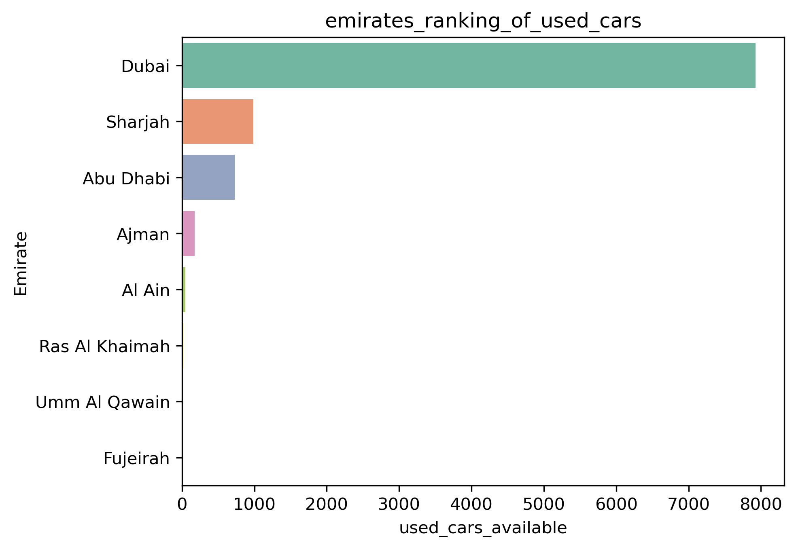
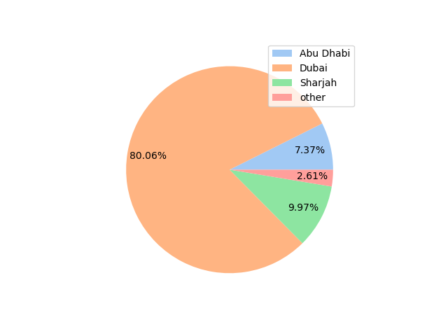
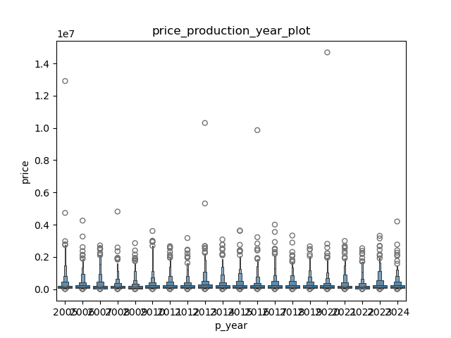
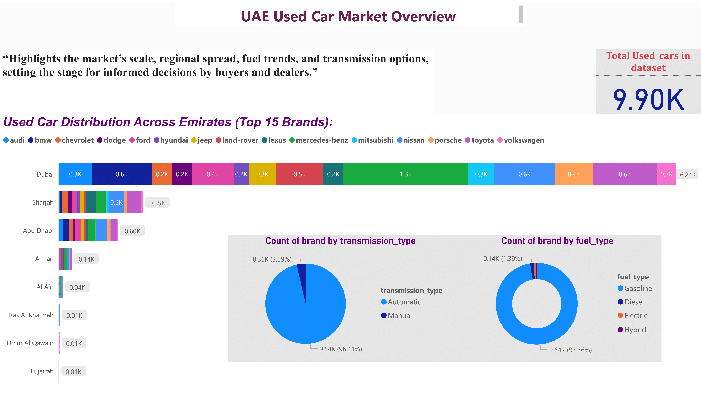
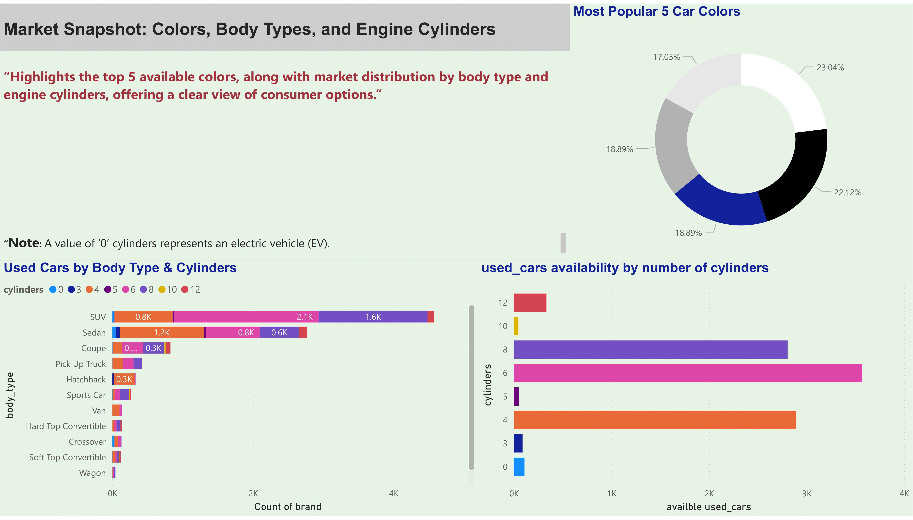
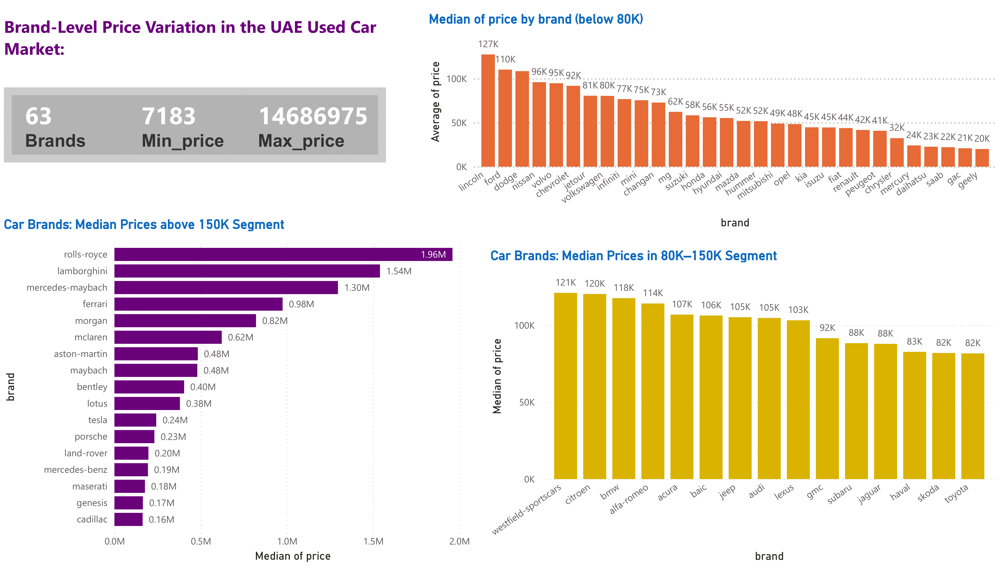
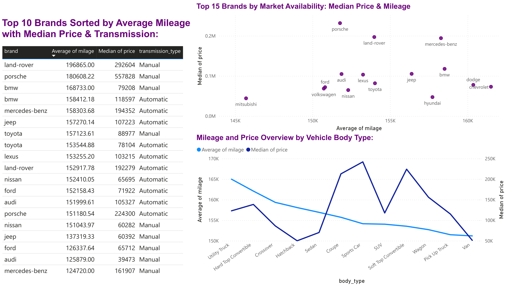
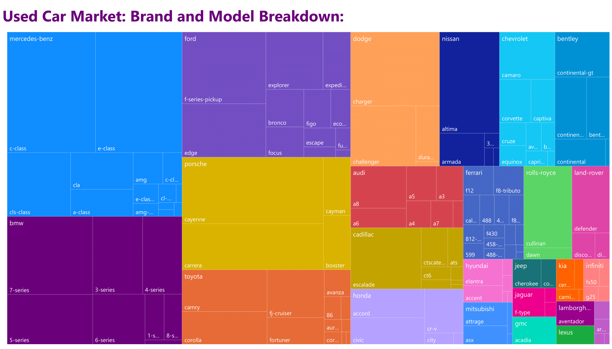
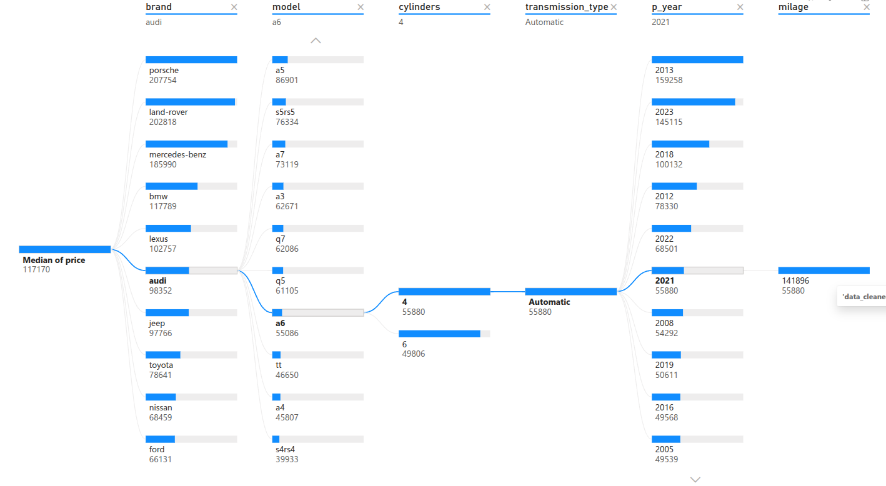
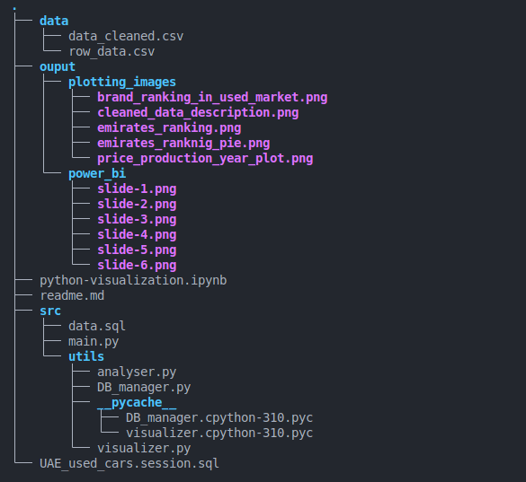

# 🇦🇪 UAE Used Car Market Analysis

### Data Analysis Project for Consumer & Dealership Insights

_Built with SQL, Python (Pandas, SQLAlchemy, Matplotlib), and Power BI_

---

## 📘 Project Overview

This project provides a comprehensive analysis of the **UAE used car market**, aimed at uncovering valuable insights for **consumers** and **dealerships**.

Using a dataset sourced from **Kaggle**, the project performs:

- Data cleaning and enrichment using **SQL** and **Python**
- Database management with **SQLAlchemy**
- Visual analytics using **Matplotlib & Power BI**
- Interactive storytelling through **Power BI dashboards**

---

## 🎯 Objectives

1. **Data Cleaning & Enrichment** – Identify, clean, and fill missing or invalid values using SQL and external data lookups.
2. **Database Integration** – Create an SQL engine in Python using **SQLAlchemy** for dynamic query execution and data management.
3. **Visualization Development** – Build flexible, reusable visualization functions in Python.
4. **Interactive Dashboarding** – Design a six-slide **Power BI report** to communicate key insights effectively.

---

## 🧩 Dataset Description

The cleaned dataset includes the following fields:

| Column                | Description                                    |
| --------------------- | ---------------------------------------------- |
| **brand**             | Manufacturer of the vehicle                    |
| **model**             | Model name                                     |
| **body_type**         | Body style (SUV, Sedan, Hatchback, etc.)       |
| **color**             | Exterior color                                 |
| **cylinder**          | Number of engine cylinders                     |
| **emirate**           | Emirate where the car is listed                |
| **fuel_type**         | Fuel type (Gasoline, Diesel, Electric, Hybrid) |
| **mileage**           | Total distance driven (in km)                  |
| **production_year**   | Year of manufacture                            |
| **price**             | Vehicle price in AED                           |
| **transmission_type** | Transmission type (Manual, Automatic, etc.)    |

---

## 🧹 Data Cleaning Process

- Removed invalid or `"other"` records using SQL filtering.
- Filled missing categorical values via targeted lookups.
- Ensured normalization and consistency of all columns.
- Exported the final dataset as `uae_used_cars_cleaned.csv`.

---

## 🐍 Python Implementation

Two core classes were implemented for modularity and scalability:

### **1️⃣ Database Management Class**

- Built with **SQLAlchemy** for establishing and managing database connections.
- Allows executing SQL queries directly from Python and loading data into Pandas DataFrames.

### **2️⃣ Visualization Class**

- Contains reusable, parameterized visualization methods (bar charts, pie charts, histograms, scatter plots).
- Saves all visual outputs to the `output_images/` folder for further reporting.

#### 📷 Sample Python Visualizations

| Visualization                | Description                               | Preview                                                                       |
| ---------------------------- | ----------------------------------------- | ----------------------------------------------------------------------------- |
| **Brand Ranking**            | Top brands by number of listings          |  |
| **Emirates Ranking**         | Distribution of listings by Emirate       |               |
| **Emirates Pie Chart**       | Emirate-wise market share                 |               |
| **Price vs Production Year** | Relationship between price and model year |        |

---

## 📊 Power BI Dashboard

The Power BI report summarizes findings in **six storytelling slides**, providing an interactive market overview.

---

### 🖼️ Slide 1 — **Market Overview**

- Horizontal bar: Car availability by Emirate (Top 15 Brands legend)
- KPI card: Total **9.9K** used cars in dataset
- Pie chart: Transmission distribution (Manual, Automatic, Electric, Hybrid)
- Donut chart: Fuel type distribution

---

### 🖼️ Slide 2 — **Availability**

- Donut chart: Top 5 car colors
- Bar 1: Count of used cars by body type & cylinder
- Bar 2: Car count by cylinder number

---

### 🖼️ Slide 3 — **Price Analysis**

- KPIs: Number of brands, min & max prices
- Vertical bar (≤ 80K AED): Median price by brand
- Vertical bar (80K–150K AED): Median price by brand
- Horizontal bar (> 150K AED): High-end segment

---

### 🖼️ Slide 4 — **Consumption Insights**

- Table: Top brands with average mileage, median price, transmission type
- Scatter plot: Median price vs mileage (Top 15 brands)
- Line plot: Mileage vs price, colored by body type

---

### 🖼️ Slide 5 — **Model Distribution**

- Treemap: Brand vs Model distribution by car availability

---

### 🖼️ Slide 6 — **Decision Tree**

- Interactive **decomposition tree** to explore median price by:
  - Brand
  - Model
  - Cylinder
  - Transmission
  - Production Year

---

## 🛠️ Tech Stack

| Category                 | Tools                                   |
| ------------------------ | --------------------------------------- |
| **Data Source**          | Kaggle Dataset                          |
| **Database & Cleaning**  | SQL, SQLite                             |
| **Analysis & Scripting** | Python (Pandas, SQLAlchemy, Matplotlib) |
| **Visualization & BI**   | Power BI                                |
| **IDE**                  | Visual Studio Code                      |

---

## 📂 Repository Structure

